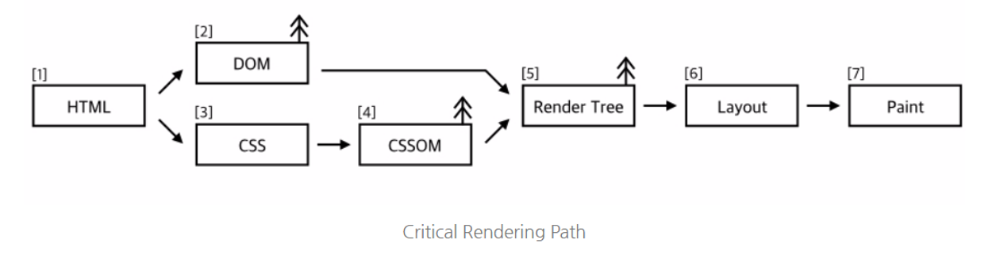
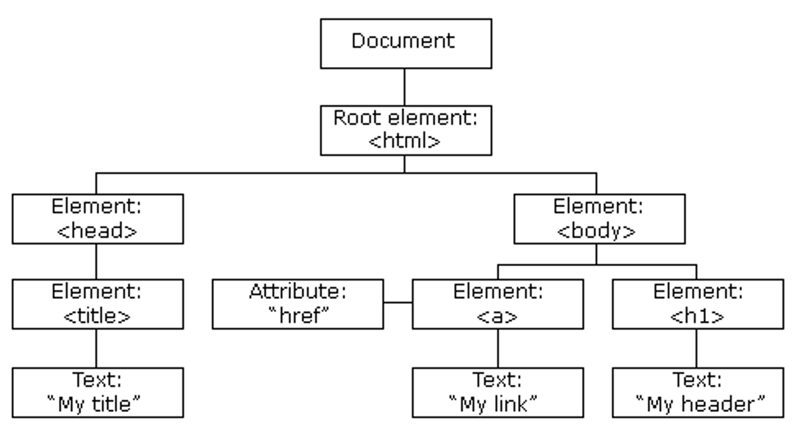
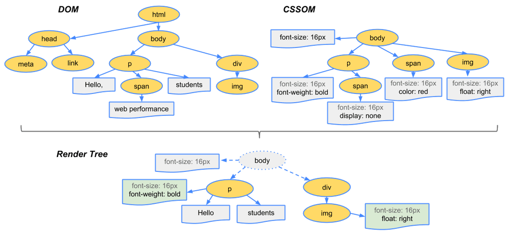

## 브라우저의 렌더링이란?

> 서버에서 가져온 웹 페이지를 브라우저에 표시하는 것

구체적으로는, 브라우저의 렌더링 엔진이 웹 페이지의 HTML/CSS/JavaScript 와 같은 리소스들을 읽고 해석하여 화면에 나타내는 과정을 이야기한다.

## 렌더링 과정

브라우저가 화면에 웹페이지를 나타내는 일련의 과정들은, **CRP**(Critical Rendering Path)로 정리할 수 있다. 가장 중요한 단계라는 뜻이다!



웹 페이지가 표시되기 위해 필요한 최소한의 단계를 나타내며, HTML, CSS, JavaScript의 로딩과 파싱, 그리고 화면에 렌더링되는 과정을 포함한다.

1. HTML 파싱 및 DOM 트리 생성
   - 서버에서 받은 HTML 문서를 읽고 파싱하여 DOM 을 생성한다
2. CSS 파싱 및 계산
   - HTML 문서를 읽다가 스타일시트를 만나면 CSSOM 을 생성하고, 각 DOM element 에 적용되어야 하는 스타일을 모두 계산한다
3. 렌더링 트리 생성
   - DOM 트리와 CSSOM 트리가 완성되면, 이 두개를 결합하여 렌더링 트리를 생성한다
   - 각 노드와 노드에 적용되어야 하는 스타일을 연결하는 과정이다
4. 레이아웃
   - 각 element 에 적용된 스타일을 바탕으로, 위치와 크기들을 계산하여 레이아웃을 구성한다
5. 페인팅
   - 레이아웃을 사용하여 브라우저 화면 상에 픽셀로 실제로 출력하는 과정이다

<br>

## DOM

> Document Object Model



서버에서 받은 HTML 을 바탕으로 DOM 이 점점 완성된다.

HTML 응답 ⇒ 토큰(태그) ⇒ 노드 ⇒ DOM 트리 로 변환되는 것이다.
각 노드들은 토큰의 부모-자식 관계를 바탕으로 DOM 트리에 연결된다.

```html
<div class="parent">
  <div class="child"></div>
</div>
```

이렇게 생긴 HTML 문서가 있다면, div.parent 노드 안에 div.child 노드를 연결하는 방식으로 부모-자식 위계가 존재하는 DOM 을 구축해 나가는 것이다.

<br>

## CSSOM

> CSS Object Model

DOM 에게 스타일 시트를 입히기 위해 생성되는 객체 모델이다.

DOM 과 유사하지만 다른 점이 존재한다. 위에 작성한 것 처럼 DOM 은 파싱과 동시에 점점 늘어나는 형태이지만, CSSOM 은 그렇지 않다. 모든 CSS 가 분석되어야 완성되는 것이며, 완성될 때 까지 사용 되지 않는 친구이다.

```css
.child {
  background-color: 'yellow';
}

.child {
  color: 'red';
  background-color: 'white';
}
/*
마지막 스타일 규칙까지 읽어야 정상적으로 CSSOM 이 완성된다!
*/
```

CSS 의 C 는 `“Cascade”` 로, 종속/폭포 라는 의미이다. CSS 를 쭉 읽어나가다가 같은 노드에 적용하고자 하는 새로운 규칙이 있다면, 그 친구로 덮어씌워지는 것이다. 따라서 전체 스타일시트를 모두 해석하기 전 까지는 CSSOM 을 완성할 수 없는 것이다.

<br>

## Render Tree

> 렌더링의 대상이 되는 트리, DOM + CSSOM

화면에 출력되어야 하는 노드와 스타일만을 정리한 트리이다.



`display: none` 은 렌더 트리에 포함되지 않는다. 또한 CSSOM 에 있던 스타일들도 실제 적용되어야 하는 노드와 연결된다. **최종적으로 화면에 출력되어야 하는 것**만 들어있다고 생각하면 된다..!

<br>

## Layout

> 화면(뷰포트) 내에서 DOM 요소의 위치/크기를 계산

렌더 트리를 바탕으로 각 요소의 크기와 위치를 계산하는 과정이다. 여기서 계산한 정보는 다음 단계인 페인팅에서 화면에 요소를 그릴 때 쓰인다.

렌더 트리를 루트부터 순회하면서 계산을 마치고, 계산된 위치와 크기들을 트리에 반영한다. 상대적인 값들 (%) 역시 이 과정을 통해 절대적인 값 (px) 로 변환된다.

렌더러의 “layout” / “reflow” 메서드가 호출됨으로써 이 과정이 진행된다. (**레이아웃이 변경되면 리플로우가 발생한다.**)

<br>

## Painting

> 계산된 크기/위치를 바탕으로 노드들을 화면에 채우기

말 그대로, 각 노드들을 화면에 페인팅하는 과정이다. 레이아웃 단계에서 각 박스들을 화면상의 픽셀로 변환했다면, 페인팅 단계에서는 텍스트/색상/경계선/그림자 같은 시각적인 요소들을 화면에 그린다.

렌더러의 “paint” 메서드가 호출되면서 이 과정이 진행된다.

<br>

## Reflow & Repaint

### **리플로우(Reflow)**

렌더 트리에서 요소의 크기나 위치 등의 레이아웃에 변화가 생길 때 발생하는 과정이다. 렌더 트리의 일부 또는 전체가 다시 계산되고 브라우저가 새로운 레이아웃을 구성하는 것이다.

1. DOM 요소의 추가, 제거 또는 위치 변경 등과 같이 레이아웃에 영향을 주는 변화가 발생할 때 리플로우가 발생
2. 렌더 트리의 레이아웃을 다시 계산하고, 각 요소의 위치와 크기를 재조정
3. 리플로우가 발생한 요소와 그 자식 요소, 그리고 이들의 하위 요소들에 대한 스타일, 구조, 레이아웃 등이 다시 계산

   ⇒ 비용이 큰 작업!

브라우저의 성능에 영향을 미칠 수 있으므로 리플로우 과정을 최소화하는 것이 중요하다.

### **리페인트(Repaint)**

리페인트는 요소의 스타일 변경 등으로 인해 요소의 외관이 변경될 때 발생하는 과정이다. 요소의 내용이나 구조가 변경되지 않고 오직 스타일만 변경되는 경우이다.

1. 요소의 스타일이 변경될 때 발생 (**크기나 위치가 아닌**, 색상, 글꼴, 테두리 스타일 등의 스타일 속성이 변경될 때)
2. 리페인트는 리플로우보다 비용이 적게 든다고 한다. 변경된 부분만 다시 칠하면 되기 때문이다.
