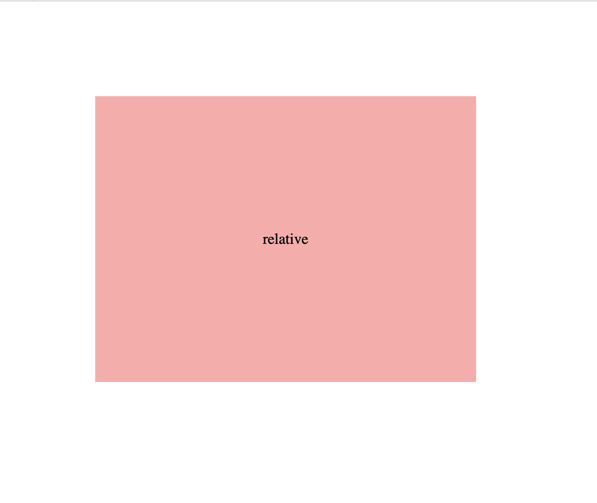
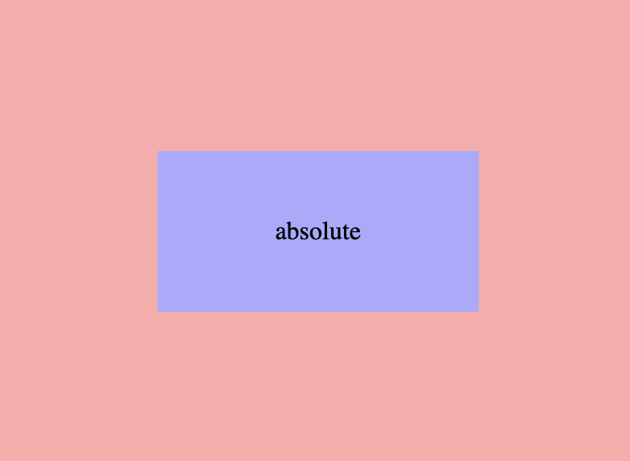
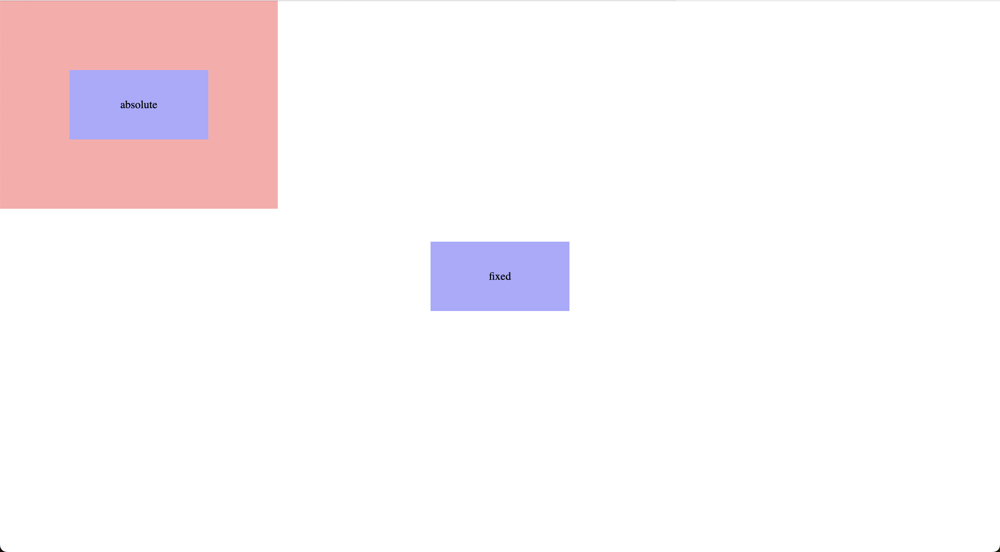
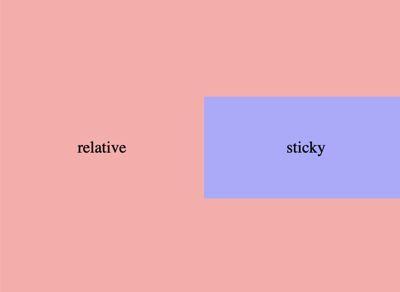

### 1. reset.css 와 normalize.css 의 차이점은 무엇인가요?

- Reset.css 는 브라우저의 모든 기본 스타일을 초기화시키기 위해 사용한다. 예시로 h1 태그와 p 태그는 같은 스타일을 가지게 된다.
- Normalize.css 는 유용한 기본 스타일을 보존한다. 브라우저에 따른 스타일 차이를 보완한다.

### 2. position 속성에 대해 설명해주세요

- `static`
  일반적인 문서 흐름에 따라 배치한다. top, left, right, bottom, z-index 속성이 아무런 영향도 주지 않는다.
- `relative`
  일반적인 문서 흐름에 따라 배치한다. 자신을 기준으로 top, left, right, bottom 오프셋을 적용한다. 따라서 페이지 레이아웃에서 요소가 차지하는 공간은 `static` 일때와 같다.
  아래는 relative 요소에 top, left 오프셋을 100px 로 준 경우이다.
  
- `absolute`
  요소를 일반적인 문서 흐름에서 배제한다. 가장 가까운 요소 중 position 속성이 `static` 이 아닌 요소를 기준으로 top, left, right, bottom 이 위치를 지정한다. 지정 요소가 없다면 초기 컨테이너 블럭을 기준으로 적용한다.
  ```css
  .absolute {
  	position: absolute;
  	top: 50%;
  	left: 50%;
  	transform: translate(-50%, -50%);
  }
  ```
  
- `fixed`
  요소를 일반적인 문서 흐름에서 배제한다. 조상 요소 중`transform`, `perspective`, `filter` 속성이 `none` 이 아닌 요소가 하나라도 있다면 해당 조상을 기준으로 배치되며, 지정 요소가 없다면 뷰포트의 초기 컨테이너 블럭을 기준으로 적용한다 .
  ```css
  .fixed {
  	position: fixed;
  	top: 50%;
  	left: 50%;
  	transform: translate(-50%, -50%);
  }
  ```
  
- `sticky`
  요소를 일반적인 문서 흐름대로 배치한다. 자신과 가장 가까운 조상을 기준으로 top, left, right, bottom 의 오프셋을 적용한다.
  ```css
  .sticky {
  	position: sticky;
  	left: 4000px;
  }
  ```
  

### 3. float 속성에 대해 설명해주세요

- `none`
  일반적인 흐름에 따라 배치한다.
- `left`
  자신을 포함하고 있는 컨테이너의 좌측에 떠다니는 요소이다.
- `right`
  자신을 포함하고 있는 컨테이너의 우측에 떠다니는 요소이다.
- `inline-start`
  자신을 포함한 블록이 시작하는 쪽에 떠다니는 요소이다. 즉, ltr(left to right) 스크립트에선 왼쪽에서 떠다니며 rtl(right to left) 스크립트에선 오른쪽에서 떠다닌다.
- `inline-end`
  자신을 포함한 블록이 끝나는 쪽에 떠다니는 요소이다. 즉, ltr(left to right) 스크립트에선 오른쪽에서 떠다니며 rtl(right to left) 스크립트에선 왼쪽에서 떠다닌다.

### 4. display 속성에 대해 설명해주세요

- `none`
  화면에서 속성을 제거한다.
- `block`
  기본적으로 width 가 100% 를 차지하게 되어 현재 컨테이너의 가로 한줄을 모두 차지하게 된다. 다음에 오는 요소는 무조건 줄바꿈 처리가 된다. width 와 height 속성을 지정할 수 있다.
- `inline`
  컨텐츠를 감쌀 정도의 크기만 갖게 되며 줄바꿈이 되지 않는다. width, height 속성을 지정할 수 없다.
- `inline-block`
  inline 과 block 의 특징을 모두 합쳐놓은 속성이다. 기본적으로 inline 속성을 갖는다. 줄바꿈이 되지 않지만 width, height 속성을 지정할 수 있다.
- `flex`
  레이아웃을 하나의 축으로 정렬하기 위해 사용한다.
- `grid`
  레이아웃을 2개의 축으로 정렬하기 위해 사용한다.

### 5. box-sizing 속성에 대해 설명해주세요

박스의 크기를 지정하는 방식을 변경하는 속성이다.

- `content-box`
  padding, border, margin 등의 속성을 포함하지 않고 크기가 지정된다.
- `border-box`
  padding, border 속성을 포함한 크기를 지정할 수 있다. margin 요소는 포함하지 않는다.

### 6. CSS 캐스케이딩에 대해 설명해주세요

CSS 스타일을 적용하는 규칙이다. 캐스케이딩은 우선순위 및 스타일 상속에 따라 스타일 요소를 결정할 수 있게 한다.

1. **중요도 - 스타일 시트를 누가 작성했느냐**

   스타일 시트는 작성자, 사용자, 사용자 도구(브라우저 등)에 의해 작성될 수 있다.

   > 작성자 → 사용자 → 사용자 도구(브라우저)

   작성자 스타일 시트, 사용자 스타일 시트, 사용자 도구 스타일 시트 순으로 중요도가 결정된다.

2. **명시도 - 셀렉터의 범위**

   셀렉터가 가리키는 요소가 명확할 수록 높은 명시도를 가진다. 여러 범위를 가리키는 셀렉터보다 적은 범위를 가리키는 셀렉터의 명시도가 높다.

   > 인라인 → id → class → 태그

3. **코드 순서 - 코드의 위치**

   뒤에 위치한 코드는 앞서 작성한 코드를 덮어쓸 수 있다.

4. **상속 - 부모의 요소에 따른 스타일**

   자식 태그는 부모 태그의 스타일에 따라 상속되는 스타일이 있다.

### 7. margin 과 padding 의 차이점에 대해 설명해주세요

- `padding`
  콘텐츠 요소와 border 사이의 간격을 지정해주기 위해 사용한다.
- `margin`
  border 의 바깥쪽 영역을 확장하여 다른 요소와의 거리를 두기 위해 사용한다.

### 8. px, rem, em, vh, vw 단위에 대해 설명해주세요

- `px`
  화면에 표시되는 가장 작은 단위를 의미하며 절대값이다.
- `rem`
  브라우저가 설정한 html 폰트 크기를 기준으로 1rem이 된다.
  브라우저의 font-size 가 10px 이면 1rem 은 10px 이 된다.
- `em`
  요소의 폰트 크기를 기준으로 1em 이 되며, 요소의 글꼴 크기가 없는 경우 부모의 폰트 크기를 기준으로 1em 을 설정한다.
- `vh`
  뷰포트의 높이를 기준으로 한 단위이다.
- `vw`
  뷰포트의 너비를 기준으로 한 단위이다.

### 9. sass(scss) 의 장점에 대해 얘기해주세요

내가 생각한 SCSS 의 장점..

1. 상속 연산자를 사용해서 스타일 시트 내부에서도 각 셀렉터의 연관관계를 쉽게 파악할 수 있다.
2. 자주 사용하는 CSS 속성을 변수에 할당하여 전역적으로 사용할 수 있어 코드 작성시간이 줄어든다.
3. mixin 키워드를 사용하여 인수에 따라 가변적으로 css 속성을 할당할 수 있다.

> 출처

- https://developer.mozilla.org/en-US/
- https://velog.io/@bami/CSS-Cascading
- [http://uidesignguides.com/마진과-패딩의-차이/](http://uidesignguides.com/%EB%A7%88%EC%A7%84%EA%B3%BC-%ED%8C%A8%EB%94%A9%EC%9D%98-%EC%B0%A8%EC%9D%B4/)
- https://enai.tistory.com/49
  >
